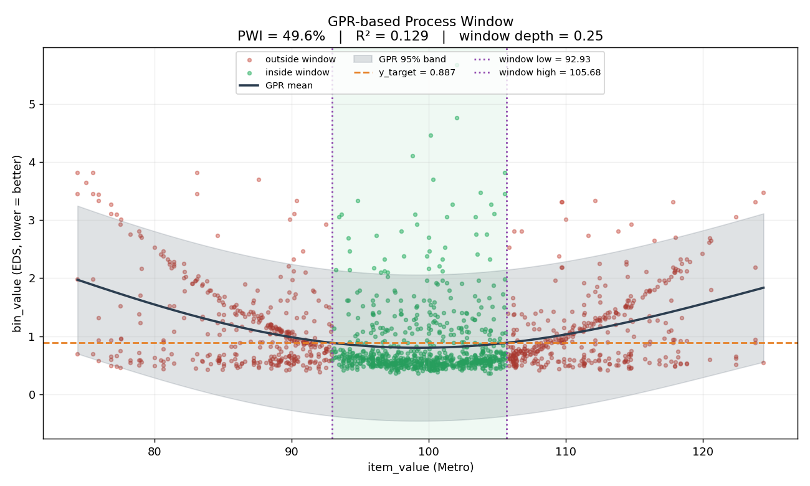
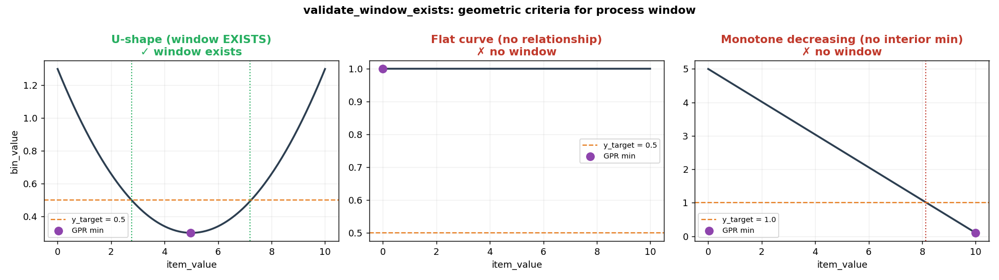
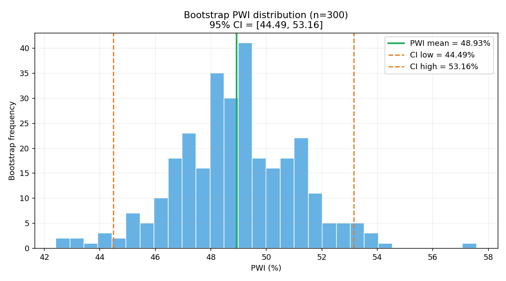
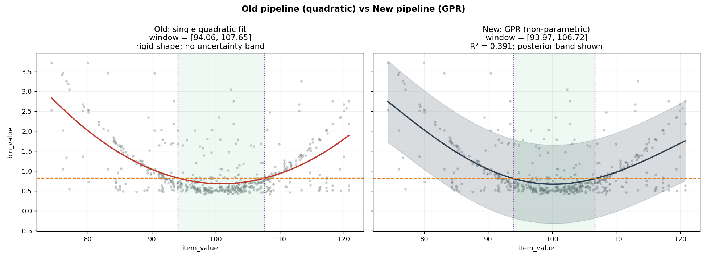

# PWI Analysis

반도체 공정 데이터(Metro + EDS)를 결합하여 **PWI(Process Window Index)** 를 산출하고, 최적 공정 윈도우(Window High / Low)를 결정하는 Python 분석 패키지입니다.

본 저장소는 **GPR 기반 직접 모델링 파이프라인**을 채택했습니다. 기존 R 코드의 "그룹화 → 가설검정 → 사후검정 → 2차 회귀" 체인을 단일 비모수 회귀(Gaussian Process Regression)로 통합하여 정합성을 높이고 계산 단계를 4개로 축소했습니다.

---

## 분석 파이프라인

```
[Metro 데이터]  +  [EDS 데이터]
       └────── 병합 (inner join) ──────┘
                       │
                  이상치 제거
              (분위수 컷: 보수적)
                       │
            Gaussian Process Regression
              bin_value ~ f(item_value)
                       │
               x_grid 예측 (y_pred, y_std)
                       │
            Window 존재 검증
        (1) min(y_pred) < y_target
        (2) 좌·우 교점 ≥ 2개
        (3) 최솟값이 두 교점 사이
                       │
              Window 탐색
       (GPR 곡선이 y_target 통과하는 x)
                       │
            Bootstrap PWI + 95% CI
```

### 핵심 개념

| 용어 | 설명 |
|------|------|
| **Metro 데이터** | 공정 측정값 (`item_value`). 분석 축(X축) |
| **EDS 데이터** | 수율 지표 (`bin_value`, 낮을수록 양호). 분석 반응(Y축) |
| **GPR** | 비모수 회귀. `bin_value`의 기댓값과 불확실성을 동시에 추정 |
| **y_target** | GPR 곡선이 통과하는 임계선. `y_pred.min() + σ · y_pred.std()` |
| **Window** | GPR 예측 곡선이 `y_target` 아래로 내려가 있는 `item_value` 구간 |
| **window_depth** | `(y_target − GPR_min) / GPR_std`. U자 곡선의 뚜렷함을 측정한 효과크기 지표 |
| **PWI Index** | 전체 웨이퍼 중 Window 범위 안에 들어오는 비율 (%) |

### 기존 R 파이프라인 대비 변화

| 단계 | 기존 (R) | 신규 (Python) |
|------|----------|---------------|
| 데이터 병합 | inner join | **유지** |
| 이상치 제거 | 분위수 컷 | **유지** (보수적) |
| 등분산 그룹화 (k=10) | O(n log n) | **제거** (GPR이 대체) |
| 정규성 판단 (왜도) | branch | **제거** |
| ANOVA / Kruskal-Wallis | O(n·k) | **제거** |
| 사후검정 (Tamhane / Dunn) | O(k²·n) — **병목** | **제거** |
| Good Group 식별 | post-hoc 의존 | **제거** |
| 좌/우 2차 회귀 + 루트 | 복소근 위험 | GPR + grid crossing 으로 대체 |
| Window CI | 없음 | **GPR posterior std** 추가 |
| PWI CI | 없음 | **Bootstrap 95% CI** 추가 |

---

## 시각화

### 1. 파이프라인 전체 모습



데이터(녹/적색 점), GPR 평균(검정 곡선)과 95% posterior band(회색 영역), `y_target`(주황 점선), window 경계(보라 점선)를 한 그림에 표시합니다. 녹색 점이 window 내부, 적색 점이 외부.

### 2. Window 존재 검증 (3가지 기하 조건)



`validate_window_exists`가 이 세 가지를 동시에 검사합니다:

| 조건 | 의미 |
|------|------|
| `min(y_pred) < y_target` | 곡선이 임계선 아래로 내려가야 함 |
| 교점 ≥ 2개 | window 양쪽 경계가 모두 존재해야 함 |
| `left_cross < min_idx < right_cross` | 최솟값이 두 교점 사이 (단조 관계 배제) |

U자형 → window **있음**, 평탄/단조 → window **없음** 으로 안전 종료. 기존 R 코드의 p-value 임계값 의존을 대체합니다.

### 3. Bootstrap PWI 분포 + 95% CI



PWI 점추정(녹색 실선)과 Bootstrap 95% CI(주황 점선). 현업이 PWI 단일 값이 아닌 **불확실성 구간**을 함께 보고받습니다.

### 4. 구 파이프라인 vs 신 파이프라인 (동일 데이터)



- **좌측**: 단일 2차 다항식 fit (기존 방식의 단순화 비교) — 곡률 가정 고정, 불확실성 band 없음, 데이터 끝 영역에서 외삽 위험
- **우측**: GPR fit — 데이터로부터 곡률·잡음 자동 추정, posterior band 제공, U자 외 패턴(다중 굴곡 등)도 자연스럽게 수용

### 효과 요약

| 측면 | 기존 (R) | 신규 (Python) |
|------|----------|---------------|
| 계산 병목 | O(k²·n) 사후검정 | **제거** — 단일 GPR 모델 fitting |
| 임의 파라미터 | k=10, α=0.05, 왜도 임계 1.3 | **σ_factor 1개** (의미: window 폭 제어) |
| 분포 가정 | 정규/비정규 분기 | **무가정** (GPR은 비모수) |
| Window CI | 없음 | **GPR posterior std** |
| PWI CI | 없음 | **Bootstrap 95% CI** |
| 결과 해석 | p < 0.05 이분법 | R², `window_depth` 연속 지표 |
| 코드 모듈 수 | 8개 (grouping/hypothesis/posthoc 포함) | **5개** (3개 모듈 제거) |

---

## 프로젝트 구조

```
pwi_analysis/           ← 분석 패키지
├── config.py           ← AnalysisConfig: 모든 파라미터 중앙 관리
├── preprocess.py       ← 데이터 병합 + 분위수 기반 이상치 제거
├── modeling.py         ← GPR 피팅 + Window 존재 검증
├── windowing.py        ← Window 경계 탐색 + Bootstrap PWI CI
├── pipeline.py         ← 전체 파이프라인 오케스트레이터
└── parallel.py         ← m_key2 × bin_id 병렬 실행

tests/                  ← 단계별 단위 테스트 (28개)
├── conftest.py
├── test_preprocess.py
├── test_modeling.py
├── test_windowing.py
└── test_pipeline.py

scripts/
└── visualize.py        ← README용 시각화 생성

docs/                   ← 생성된 시각화 (PNG)

main.py                 ← 실행 데모 (단일 / 병렬 모드)
requirements.txt
```

---

## 설치

```bash
pip install -r requirements.txt
```

---

## 빠른 시작

### 데모 실행 (합성 데이터)

```bash
# 단일 분석 (m_key2 1개 × bin_id 1개)
python main.py

# 병렬 분석 (m_key2 3개 × bin_id 2개 = 6 tasks)
python main.py --parallel

# 옵션 조합
python main.py --parallel --samples 1000 --keys 5 --bins 3
```

**실행 옵션**

| 옵션 | 기본값 | 설명 |
|------|--------|------|
| `--parallel` | False | 병렬 다중 키 분석 활성화 |
| `--samples` | 800 | 키당 샘플 수 |
| `--keys` | 3 | m_key2 종류 수 |
| `--bins` | 2 | bin_id 종류 수 |

### 시각화 생성

```bash
python scripts/visualize.py    # docs/*.png 생성
```

---

### 코드에서 직접 사용

#### 1. 단일 분석

```python
import pandas as pd
from pwi_analysis import AnalysisConfig, pwi_analysis

metro = pd.read_csv("metro.csv")   # root_lot_id, wafer_id, item_value, m_key2
eds   = pd.read_csv("eds.csv")     # root_lot_id, wafer_id, bin_value,  bin_id

cfg = AnalysisConfig(
    conf_level=0.95,
    gpr_length_scale=10.0,        # GPR RBF kernel initial length scale
    gpr_n_restarts=5,             # kernel hyperparameter restarts
    y_target_sigma_factor=0.25,   # window 폭 제어 (작을수록 좁은 window)
    bootstrap_n=1000,             # PWI CI 부트스트랩 횟수
)

result, message = pwi_analysis(metro, eds, cfg)

if result:
    print(f"Window : [{result.window_low:.3f} ± {result.window_low_std:.3f}, "
          f"{result.window_high:.3f} ± {result.window_high_std:.3f}]")
    print(f"PWI    : {result.pwi_index:.1f}% "
          f"(95% CI [{result.pwi_ci_low:.1f}, {result.pwi_ci_high:.1f}])")
    print(f"R²     : {result.r2:.4f}")
    print(f"Depth  : {result.window_depth:.3f}  (높을수록 뚜렷한 window)")
else:
    print(f"분석 종료: {message}")
```

#### 2. 병렬 분석 (다중 m_key2 × bin_id)

```python
from pwi_analysis import AnalysisConfig, run_parallel_pwi

metro_all = pd.read_csv("metro_all.csv")
eds_all   = pd.read_csv("eds_all.csv")

cfg = AnalysisConfig()
results = run_parallel_pwi(metro_all, eds_all, cfg=cfg, n_jobs=-1)

for r in results:
    if r["result"]:
        res = r["result"]
        print(f"{r['m_key2']} × {r['bin_id']}: "
              f"PWI={res.pwi_index}% "
              f"[CI {res.pwi_ci_low}-{res.pwi_ci_high}]")
    else:
        print(f"{r['m_key2']} × {r['bin_id']}: SKIP ({r['message']})")
```

---

## 데이터 스펙

### Metro 데이터

| 컬럼 | 타입 | 설명 |
|------|------|------|
| `root_lot_id` | int/str | Lot 식별자 (EDS와 조인 키) |
| `wafer_id` | int/str | Wafer 식별자 (EDS와 조인 키) |
| `item_value` | float | 공정 측정값 (분석 X축) |
| `m_key2` | str | 측정 항목 키 (병렬 처리 분할 단위) |

### EDS 데이터

| 컬럼 | 타입 | 설명 |
|------|------|------|
| `root_lot_id` | int/str | Lot 식별자 (Metro와 조인 키) |
| `wafer_id` | int/str | Wafer 식별자 (Metro와 조인 키) |
| `bin_value` | float | 수율 지표 (분석 Y축, 낮을수록 양호) |
| `bin_id` | str | Bin 종류 (병렬 처리 분할 단위) |

---

## 파라미터 설정 (`AnalysisConfig`)

```python
from pwi_analysis import AnalysisConfig

cfg = AnalysisConfig(
    conf_level=0.95,                # 신뢰 수준 (기본: 0.95)

    # 이상치 제거 (분위수 컷)
    metro_outlier_q_low=0.005,
    metro_outlier_q_high=0.995,
    eds_outlier_q_high=0.9995,

    # GPR 하이퍼파라미터
    gpr_length_scale=10.0,          # RBF 커널 초기 length scale
    gpr_n_restarts=5,               # 커널 최적화 재시작 횟수
    gpr_grid_points=500,            # window 탐색 grid 크기

    # Window y_target
    y_target_sigma_factor=0.25,     # y_target = GPR_min + factor × GPR_std

    # Bootstrap PWI CI
    bootstrap_n=1000,
    bootstrap_seed=0,
)
```

---

## PWIResult 필드

```python
@dataclass
class PWIResult:
    window_low:       float  # 좌측 경계
    window_high:      float  # 우측 경계
    window_low_std:   float  # GPR posterior std at left crossing
    window_high_std:  float  # GPR posterior std at right crossing
    pwi_index:        float  # PWI 점추정 (%)
    pwi_ci_low:       float  # Bootstrap 95% CI 하한 (%)
    pwi_ci_high:      float  # Bootstrap 95% CI 상한 (%)
    r2:               float  # GPR 설명력 (참고)
    y_target:         float  # 사용된 임계선
    window_depth:     float  # window 뚜렷함 (효과크기 유사)
```

---

## 테스트

```bash
# 전체 테스트 실행 (28개)
python -m pytest tests/ -v

# 특정 모듈만
python -m pytest tests/test_pipeline.py -v
```

---

## 분석이 조기 종료되는 경우

| 메시지 | 원인 | 조치 |
|--------|------|------|
| `No matching data after merge` | Metro/EDS 키 불일치 | `root_lot_id`, `wafer_id` 확인 |
| `No data remaining after outlier removal` | 이상치 컷이 너무 공격적 | 분위수 임계값 완화 |
| `No process window found` | GPR 곡선이 `y_target` 미통과 | `y_target_sigma_factor` 늘리거나 데이터 재확인 |
| `missing columns` | 필수 컬럼 부재 | Metro/EDS 스키마 확인 |

---

## 참고 문헌

- Rasmussen, C.E., Williams, C.K.I. (2006). *Gaussian Processes for Machine Learning*. MIT Press.
- Sacks, J., Welch, W.J., Mitchell, T.J., Wynn, H.P. (1989). *Design and analysis of computer experiments*. Statistical Science, 4(4), 409–423.
- Efron, B., Tibshirani, R.J. (1993). *An Introduction to the Bootstrap*. Chapman & Hall.
